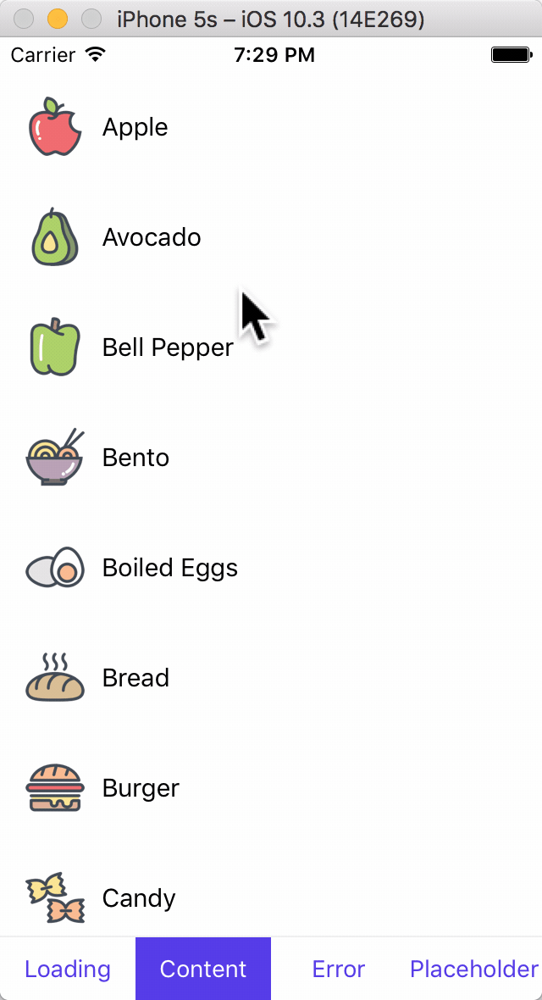
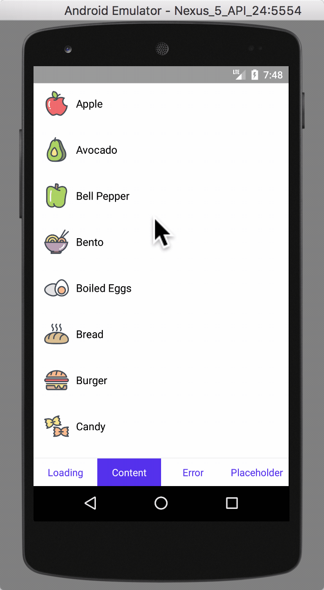

# react-native-stateview

A react native wrapper view to add `loading`, `content`, `error` and `placeholder` states to your component

<p align="center">
    
    &nbsp;&nbsp;&nbsp;&nbsp;&nbsp;&nbsp;&nbsp;&nbsp;
    
</p>

###Expo
Try it out on expo. Just download the [expo](https://expo.io/) app, scan code and you are good to go.

<p align="center">

</p>

## Installation

Using npm:

```shell
npm i --save react-native-stateview
```

Using yarn:

```shell
yarn add react-native-stateview
```

##Usage

You can wrap your view in `StateView` to give states to it. The `StateView` has with 4 states: `loading`, `content`, `placeholder` and `error`.

Import react-native-keyboard-aware-scroll-view and wrap your content inside it:

```jsx
import StateView from 'react-native-stateview'
<StateView>
    <View>
        // ...
    </View>
</StateView>
```

There are some props which you can use to configure the `StateView`, as given below in API section, but all of them are *optional*.

##API

###Props

| **Prop** | **Type** | **Defaults** | **Required** | **Description** |
|----------|----------|--------------|--------------|-----------------|
| `containerStyle` | `PropTypes.object` | `{}` |  | Style of container view |
| `state` | `PropTypes.oneOf([StateView.State.loading, StateView.State.placeholder, StateView.State.error, StateView.State.content])` | `StateView.State.loading` |  | The mode of StateView is in. One of `loading`, `content`, `error` and `placeholder` |
| `color` | `PropTypes.string` | `'#000'` |  | A general tint color for all views |
| `imageStyle` | `PropTypes.object` | `{}` |  | ... |
| `titleStyle` | `PropTypes.object` | `{}` |  | ... |
| `bodyStyle` | `PropTypes.object` | `{}` |  | ... |
| `buttonStyle` | `PropTypes.object` | `{}` |  | ... |
| `loadingView` | `PropTypes.element` | `undefined` |  | A custom loading view |
| `loadingTitle` | `PropTypes.string` | `''` |  | The title for the default loading view |
| `loadingTitleStyle` | `PropTypes.object` | `{}` |  | ... |
| `loadingLoaderStyle` | `PropTypes.object` | `{}` |  | ... |
| `placeholderView` | `PropTypes.element` | `undefined` |  | A custom placeholder view |
| `placeholderImageRes` | `PropTypes.number.isRequirednumber` | NA | Yes | Image resource id of the placeholder view image |
| `placeholderTitle` | `PropTypes.string` | `''` |  | Title text of the placeholder view |
| `placeholderBody` | `PropTypes.string` | `''` |  | Body text of the placeholder view |
| `placeholderButtonText` | `PropTypes.string` | `''` |  | Action button text of the placeholder view |
| `placeholderButtonAction` | `PropTypes.func` | `() => {}` |  | Function that is executed when the placeholder view button is clicked. The button is not rendered if this is `null` or `undefined` |
| `placeholderImageStyle` | `PropTypes.object` | `{}` |  | ... |
| `placeholderTitleStyle` | `PropTypes.object` | `{}` |  | ... |
| `placeholderBodyStyle` | `PropTypes.object` | `{}` |  | ... |
| `placeholderButtonStyle` | `PropTypes.object` | `{}` |  | ... |
| `placeholderButtonTextStyle` | `PropTypes.object` | `{}` |  | ... |
| `errorView` | `PropTypes.element` | `undefined` |  | A custom error view |
| `errorImageRes` | `PropTypes.number.isRequirednumber` | NA | Yes | Image resource id of the error view image |
| `errorTitle` | `PropTypes.string` | `''` |  | Title text of the error view |
| `errorBody` | `PropTypes.string` | `''` |  | Body text of the error view |
| `errorButtonText` | `PropTypes.string` | `''` |  | Action button text of the error view |
| `errorButtonAction` | `PropTypes.func` | `() => {}` |  | Function that is executed when the error view button is clicked. The button is not rendered if this is `null` or `undefined` |
| `errorImageStyle` | `PropTypes.object` | `{}` |  | ... |
| `errorTitleStyle` | `PropTypes.object` | `{}` |  | ... |
| `errorBodyStyle` | `PropTypes.object` | `{}` |  | ... |
| `errorButtonStyle` | `PropTypes.object` | `{}` |  | ... |
| `errorButtonTextStyle` | `PropTypes.object` | `{}` |  | ... |

## License

MIT.
